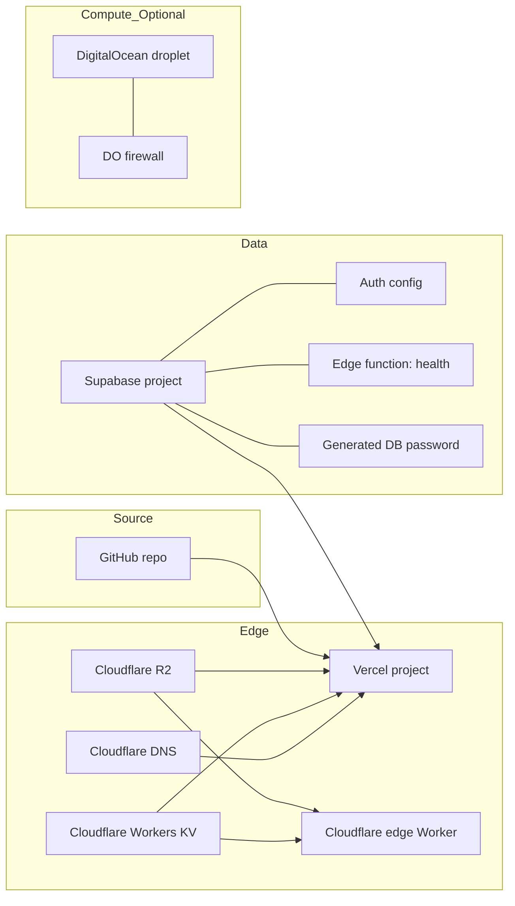

# Architecture

`terraform-stack` is a multi-provider Terraform repository that provisions the
full infrastructure footprint for a solo-engineer SaaS: a Vercel project, a
Supabase project with auth and edge functions, a Cloudflare zone with DNS, R2,
KV and an edge Worker, and an optional DigitalOcean droplet.



## What gets provisioned

Out of one `terraform apply`:

- **Vercel project** wired to a GitHub repo, with environment variables
  templated from the Supabase and Cloudflare outputs (`NEXT_PUBLIC_SUPABASE_URL`,
  the anon and service-role keys, `R2_BUCKET`, `KV_NAMESPACE_ID`).
- **Vercel domain** mapped to the project.
- **Supabase project** in your chosen region, with a generated 32-character
  database password stored in state.
- **Supabase auth** configured through `supabase_settings`: the site URL, the
  redirect allow-list, the signup policy, and the JWT lifetime.
- **Supabase edge function** (`health`) deployed from `modules/supabase/functions/health/index.ts`.
- **Cloudflare DNS** records: apex `A` to Vercel's anycast IP and `www` `CNAME`.
- **Cloudflare R2 bucket** named after the domain.
- **Cloudflare Workers KV namespace** for low-latency key-value.
- **Cloudflare edge Worker** (`modules/cloudflare/worker.js`) bound to the R2
  bucket as `ASSETS` and the KV namespace as `CACHE`, with a route mapping
  `assets.<domain>/*` to it.
- **Optional DigitalOcean droplet** with Docker pre-installed and monitoring
  on, behind a firewall that serves HTTPS publicly and keeps SSH closed by
  default. SSH opens only to the CIDR blocks listed in `ssh_allowed_cidrs`.

## Dependency graph

The Vercel module is planned last because its `env_vars` map references the
Supabase and Cloudflare module outputs. Terraform builds the ordering from
those references, so no explicit `depends_on` is needed. The DigitalOcean
module is gated behind a `count` on `enable_droplet`, so it contributes nothing
to the plan unless you opt in. Within the Cloudflare module the Worker is gated
behind `enable_worker`, and within the Supabase module the edge functions are
gated behind `enable_edge_functions`.

## Secrets flow

Tokens enter as sensitive root variables, providers consume them, and only
derived values leave as outputs. The Supabase database password is generated
with the `random` provider; the anon and service-role keys are read back from
the management API through the `supabase_apikeys` data source. All three are
marked sensitive so they are redacted from CLI output, but they still land in
state, so an encrypted remote backend is mandatory for real deployments.

## Module layout

```
terraform-stack/
├── main.tf                  # wires modules together
├── variables.tf
├── outputs.tf               # stable output contracts
├── terraform.tfvars.example
├── modules/
│   ├── vercel/              # vercel/vercel provider
│   ├── supabase/            # supabase/supabase + random; auth, edge functions, keys
│   │   └── functions/health/index.ts
│   ├── cloudflare/          # cloudflare/cloudflare; DNS, R2, KV, Worker
│   │   └── worker.js
│   └── digitalocean/        # digitalocean/digitalocean (optional)
├── examples/
│   └── single-region-saas/  # reference invocation
└── tests/
    ├── smoke.tftest.hcl
    └── cloudflare_module.tftest.hcl
```

Each module is small enough to read in a single sitting. None of them try to be
a generic abstraction over their provider; they encode the opinionated defaults
that the solo-engineer stack uses.

## State

State is local by default. Configure an encrypted remote backend for anything
you actually deploy:

```hcl
terraform {
  backend "s3" {
    bucket = "my-tf-state"
    key    = "stacks/sarma-prod/terraform.tfstate"
    region = "eu-west-2"
  }
}
```

Cloudflare R2 speaks the S3 protocol, so you can point the S3 backend at an R2
bucket and keep state in the same provider as the rest of your infrastructure.

## Continuous integration and deployment

`.github/workflows/ci.yml` runs `terraform fmt -check`, validates the root and
every module, and runs `terraform test` (mocked providers, no credentials) on
push to `main` and on pull requests. `.github/workflows/deploy.yml` is a
manually triggered workflow that plans and then applies, with the apply gated
behind a protected GitHub environment so a human approves before any real
resources are touched.

## What is not here

- A generic AWS module. AWS is its own universe; if your stack is AWS-first,
  this is not the right starter.
- Datadog, Grafana Cloud or other observability vendors. The companion repo
  [k8s-ops-toolkit](https://github.com/sarmakska/k8s-ops-toolkit) is the
  observability layer.
- Multi-region. Each module assumes a single region.
