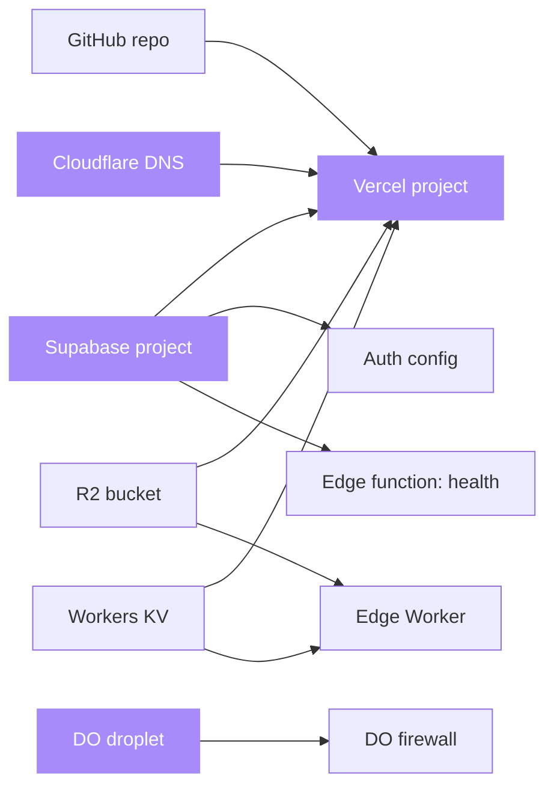

# terraform-stack

[](LICENSE)
[](https://github.com/sarmakska/terraform-stack)
[](https://github.com/sarmakska/terraform-stack/commits/main)
[](https://www.terraform.io)
[](https://registry.terraform.io/providers/vercel/vercel/latest)
[](https://registry.terraform.io/providers/supabase/supabase/latest)
[](https://registry.terraform.io/providers/cloudflare/cloudflare/latest)
[](https://registry.terraform.io/providers/digitalocean/digitalocean/latest)

**Solo-engineer cloud stack as code: Vercel, Supabase, Cloudflare and DigitalOcean wired together in one Terraform repo.**

The four services I reach for most as a solo engineer in 2026, fully described in Terraform and composed in the right dependency order. One `terraform apply` stands up a Vercel project linked to GitHub, a Supabase project with auth configured and an edge function deployed, a Cloudflare zone with DNS plus an R2 bucket, a Workers KV namespace and an edge Worker bound to both, and an optional DigitalOcean droplet behind a firewall. One `terraform destroy` tears it all down. Built by [Sarma Linux](https://sarmalinux.com).

---

## Architecture



The Vercel module is planned last because its environment variables resolve from the Supabase and Cloudflare outputs. Terraform builds the ordering from these references, so you never declare it by hand. The DigitalOcean module is gated behind `enable_droplet`, so the default footprint is three fully-managed services with no long-running compute.

## Quick start

```bash
git clone https://github.com/sarmakska/terraform-stack.git && cd terraform-stack
cp terraform.tfvars.example terraform.tfvars   # then edit with your tokens
terraform init
terraform plan
terraform apply
```

That is the whole loop. `terraform init` pulls the providers, `plan` shows you exactly what will be created, and `apply` provisions it. Tear down with `terraform destroy`.

## What is in the box

- **`modules/vercel`** : a Next.js Vercel project linked to a GitHub repo, a custom domain, and environment variables wired from the other modules' outputs (Supabase URL and keys, R2 bucket, KV namespace).
- **`modules/supabase`** : a Supabase project with a generated database password, auth configured through `supabase_settings` (site URL, redirect allow-list, signup policy, JWT lifetime), a deployed `health` edge function, and the real anon and service-role keys read back from the management API.
- **`modules/cloudflare`** : the zone's apex `A` and `www` `CNAME` records pointing at Vercel, an R2 bucket, a Workers KV namespace, and an edge Worker (`worker.js`) bound to both R2 and KV and mapped to a route.
- **`modules/digitalocean`** (optional) : an Ubuntu droplet with Docker pre-installed and monitoring on, behind a firewall that allows only SSH, HTTP and HTTPS inbound.
- **Root outputs** : project ids, the Supabase API URL and keys, the R2 bucket and KV namespace, the Worker name and route, the edge function slugs, and the droplet IP. Stable contracts you can feed into CI.
- **`.github/workflows/ci.yml`** : `fmt -check`, `validate` of the root and every module, and `terraform test` on push and pull request.
- **`.github/workflows/deploy.yml`** : a manual `plan` then `apply`, with the apply gated behind a protected GitHub environment so a human approves before anything is provisioned.

## What you need

```hcl
# terraform.tfvars
project_name = "my-app"
domain       = "example.com"
github_repo  = "you/my-app"

vercel_api_token      = "..."
supabase_access_token = "..."
supabase_org_id       = "..."
cloudflare_api_token  = "..."
digitalocean_token    = "..."   # only needed if enable_droplet = true
```

API tokens are scoped: each provider gets only the permissions it needs. Every other knob (region, JWT expiry, signup policy, worker on/off, droplet size) has a sensible default and is one variable away.

## When to use this

- You are a solo engineer or small team shipping a modern SaaS and want the wiring between Vercel, Supabase and Cloudflare as reproducible code.
- You want the same stack stood up for production, a client engagement, and a throwaway demo from one set of modules with different variable files.
- You want cost discipline: the default footprint has no idle load balancers and no surprise capacity.

## When not to use this

- Your primary cloud is AWS, Azure or GCP everything. This is opinionated about four specific providers; the generic modules for those clouds are a better fit.
- You need multi-region. Each module assumes a single region; multi-region is a different design, not a flag.
- You need a high-compliance posture out of the box (SOC2, HIPAA). You will need to harden state, secrets and audit on top of this.
- You prefer Pulumi or the CDK. This is Terraform.

## Modules

Each module is independent and small enough to read in one sitting. Use only the ones you need:

```hcl
module "vercel" {
  source = "./modules/vercel"
  # ...
}
# skip the others if you only want Vercel
```

See [docs/Modules.md](docs/Modules.md) for the full input and output reference.

## Roadmap

- [x] Vercel module (project, env, domain)
- [x] Supabase module (project, generated password, auth config, edge functions, real API keys)
- [x] Cloudflare module (zone, DNS, R2, KV, edge Worker)
- [x] DigitalOcean module (droplet, firewall, monitoring)
- [x] GitHub Actions plan/apply workflow with manual approval
- [ ] Resend module for transactional email and DKIM
- [ ] Stripe products and prices as IaC
- [ ] State backend bootstrap stack (R2-backed remote state)

## Documentation

Full documentation lives in the [project wiki](https://github.com/sarmakska/terraform-stack/wiki): a deeper architecture write-up, the per-module input and output reference, a quick-start walkthrough, troubleshooting, and the roadmap. The same pages are mirrored under [`docs/`](docs/) in the repo, and [ARCHITECTURE.md](ARCHITECTURE.md), [ROADMAP.md](ROADMAP.md) and [CHANGELOG.md](CHANGELOG.md) sit at the root.

## License

MIT. Built by [Sarma Linux](https://sarmalinux.com).

---

## More open source by Sarma

Part of a portfolio of twelve production-shaped open-source repositories built and maintained by [Sarma](https://sarmalinux.com).

| Repository | What it is |
|---|---|
| [Sarmalink-ai](https://github.com/sarmakska/Sarmalink-ai) | Multi-provider OpenAI-compatible AI gateway with 14-engine failover and intent-based plugin auto-routing |
| [agent-orchestrator](https://github.com/sarmakska/agent-orchestrator) | Durable multi-agent workflows in TypeScript with deterministic replay and Inspector UI |
| [voice-agent-starter](https://github.com/sarmakska/voice-agent-starter) | Sub-second full-duplex voice agent loop. WebRTC, mediasoup, pluggable STT / LLM / TTS |
| [ai-eval-runner](https://github.com/sarmakska/ai-eval-runner) | Evals as code. Python, DuckDB, FastAPI viewer, regression mode for CI |
| [mcp-server-toolkit](https://github.com/sarmakska/mcp-server-toolkit) | Production Model Context Protocol server starter (Python / FastAPI) |
| [local-llm-router](https://github.com/sarmakska/local-llm-router) | OpenAI-compatible proxy that routes to Ollama or cloud providers based on policy |
| [rag-over-pdf](https://github.com/sarmakska/rag-over-pdf) | Minimal end-to-end RAG starter for PDF corpora |
| [receipt-scanner](https://github.com/sarmakska/receipt-scanner) | Vision OCR for receipts with Zod-validated JSON output |
| [webhook-to-email](https://github.com/sarmakska/webhook-to-email) | Webhook receiver that forwards events to email via Resend |
| [k8s-ops-toolkit](https://github.com/sarmakska/k8s-ops-toolkit) | Helm chart for shipping Next.js to Kubernetes with full observability stack |
| [terraform-stack](https://github.com/sarmakska/terraform-stack) | Vercel + Supabase + Cloudflare + DigitalOcean modules in one Terraform repo |
| [staff-portal](https://github.com/sarmakska/staff-portal) | Open-source HR / ops portal for leave, attendance, expenses, and kiosk mode |

Engineering essays at [sarmalinux.com/blog](https://sarmalinux.com/blog) &middot; All projects at [sarmalinux.com/open-source](https://sarmalinux.com/open-source)
