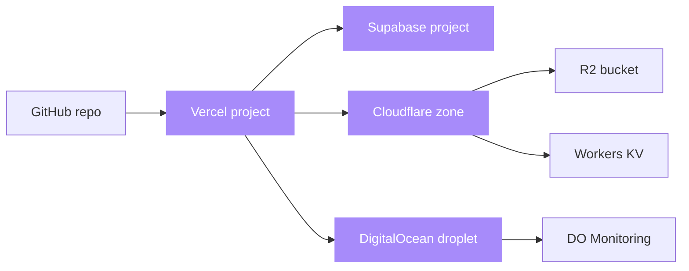

# terraform-stack

[](https://opensource.org/licenses/MIT)
[](https://www.terraform.io)
[](https://registry.terraform.io/providers/vercel/vercel/latest)
[](https://registry.terraform.io/providers/supabase/supabase/latest)
[](https://registry.terraform.io/providers/cloudflare/cloudflare/latest)
[](https://registry.terraform.io/providers/digitalocean/digitalocean/latest)
[](https://github.com/sarmakska/terraform-stack)

**Solo-engineer-stack as code: Vercel + Supabase + Cloudflare + DigitalOcean in one Terraform repo.**

Built by [Sarma Linux](https://sarmalinux.com).

---

## What this is

The four services I use most as a solo engineer in 2026, fully described in Terraform. Run `terraform apply` and you have:

- A Next.js Vercel project linked to a GitHub repo
- A Supabase project with environment variables wired into Vercel
- A Cloudflare zone with DNS records, R2 bucket, and Workers KV namespace
- A DigitalOcean droplet running a worker, with monitoring on

All in one apply. Tear down with one destroy. Reproducible across personal projects, client work, demo environments.

## Architecture



## Quick start

```bash
git clone https://github.com/sarmakska/terraform-stack.git
cd terraform-stack
cp terraform.tfvars.example terraform.tfvars
# Edit terraform.tfvars with your credentials
terraform init
terraform plan
terraform apply
```

## What you need

```hcl
# terraform.tfvars
project_name = "my-app"
domain       = "example.com"
github_repo  = "you/my-app"

vercel_api_token       = "..."
supabase_access_token  = "..."
cloudflare_api_token   = "..."
digitalocean_token     = "..."
```

API tokens are scoped: each provider gets only the permissions it needs.

## Modules

- `modules/vercel` — project, env vars, custom domain, deployment hooks
- `modules/supabase` — project, database password, JWT secret rotation
- `modules/cloudflare` — zone, DNS, R2 bucket, Workers KV namespace
- `modules/digitalocean` — droplet (Hetzner-equivalent if you swap providers), DO monitoring

Each module is independent. Use only the ones you need:

```hcl
module "vercel" {
  source = "./modules/vercel"
  ...
}
# Skip the others if you only want Vercel
```

## What this is NOT

- Multi-environment management (use Terraform workspaces or Terragrunt for that)
- A replacement for Pulumi/CDK if you prefer those
- Production-ready out of the box for high-compliance environments (you will need to harden it)
- Free of opinions: it picks specific regions, SKUs, and config patterns

## Roadmap

- [x] Vercel module (project, env, domain)
- [x] Supabase module (project, secrets)
- [x] Cloudflare module (zone, R2, KV)
- [x] DigitalOcean module (droplet, monitoring)
- [ ] AWS module (EC2, RDS, S3) for those who insist
- [ ] GCP module (Cloud Run, Cloud SQL, GCS)
- [ ] Hetzner Cloud module
- [ ] Tailscale module for secure private networking
- [ ] Outputs for CI/CD: GitHub Actions secrets

## License

MIT.

Built by [Sarma Linux](https://sarmalinux.com).
