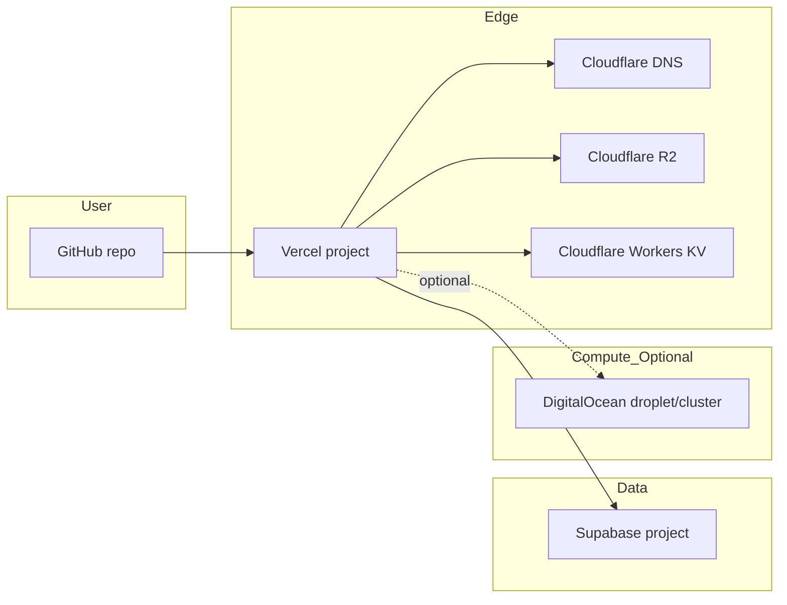

# Architecture

`terraform-stack` is a multi-provider Terraform repository that
provisions the full infrastructure footprint for a solo-engineer SaaS:
a Vercel project, a Supabase project, Cloudflare DNS + R2 + KV, and
optional DigitalOcean compute.



## What gets provisioned

Out of one `terraform apply`:

- **Vercel project** wired to a GitHub repo, with environment variables
  templated from the Supabase + Cloudflare outputs.
- **Vercel domain** and TLS via Cloudflare DNS.
- **Supabase project** in your chosen region, with a generated database
  password stored in state (mark sensitive in your CI).
- **Cloudflare zone** records (apex A and `www` CNAME) pointing at Vercel.
- **Cloudflare R2 bucket** for object storage.
- **Cloudflare Workers KV namespace** for low-latency key-value.
- **Optional DigitalOcean** droplet or k8s cluster if you set that
  module's variables.

## Module layout

```
terraform-stack/
├── main.tf                  # wires modules together
├── variables.tf
├── terraform.tfvars.example
├── modules/
│   ├── vercel/              # vercel/vercel provider
│   ├── supabase/            # supabase/supabase provider
│   ├── cloudflare/          # cloudflare/cloudflare provider
│   └── digitalocean/        # digitalocean/digitalocean provider (optional)
└── examples/
    └── single-region-saas/  # reference invocation
```

Each module is small enough to read in a single sitting. None of them
try to be a generic abstraction over their provider; they encode the
opinionated defaults that the solo-engineer stack uses.

## State

State is local by default. You should configure a remote backend for
anything you actually deploy:

```hcl
terraform {
  backend "s3" {
    bucket = "my-tf-state"
    key    = "stacks/sarma-prod/terraform.tfstate"
    region = "eu-west-2"
  }
}
```

Cloudflare R2 also speaks the S3 protocol; if you want to keep state
in the same provider as the rest of your infrastructure, point the S3
backend at R2.

## Why one repo, not separate stacks per provider

The point of this repo is to be the *minimal* surface that ties them
together. Each provider has its own module so you can extract them if
you want. The root `main.tf` exists so you can `terraform apply` once
and have everything stand up in the right order.

## What is not here

- A generic AWS module. AWS is its own universe; if your stack is AWS-first, this is not the right starter.
- Datadog, Grafana Cloud, or other observability vendors. The companion repo [k8s-ops-toolkit](https://github.com/sarmakska/k8s-ops-toolkit) is the observability layer.
- CI/CD wiring. Use GitHub Actions or your CI of choice; the outputs of `terraform output` plug into any pipeline.
